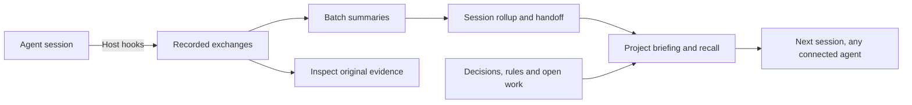

<div align="center">

# TIM
### Theoretically Infinite Memory

**Keep the decisions. Carry the context. Continue the work.**

A local-first memory system for AI agents, built around projects and the work between sessions.

[](https://github.com/ZF-IT-Automation/tim/actions/workflows/ci.yml)


[Get started](#get-started) · [Features](#what-tim-remembers) · [Compare](#how-tim-compares) · [Roadmap](#status-and-roadmap)

</div>

---

Your agent can read the code again. Reconstructing **why you chose an approach, what already failed, and where you stopped** is harder.

TIM keeps that working knowledge in a SQLite database you control. Connect agents through MCP, bind them to a project, and give the next session a useful starting point: decisions, rules, open work, summaries and the original exchanges behind them.

**A typical workflow:** discuss an approach in one agent, implement it in another, return a week later, and recover the project's recorded reasoning and next steps from the same memory store.

“Theoretically Infinite” means memory can outlive any one context window. It does not promise unlimited disk space, perfect recall or lossless summaries.

## Why TIM

- **Your memory, on your machine.** The core store and full-text search run locally. No hosted TIM account, remote vector database or sync service is required.
- **Continuity across tools.** Claude Code, Codex, Cursor and Hermes have setup support; other MCP clients can use the same tools. Automatic capture depends on host hooks, not just an MCP connection.
- **Projects are first-class.** Explicit binding, structured sections, tasks, bugs and decisions keep different bodies of work organized.
- **Summaries with an escape hatch.** Batch summaries and rollups compress history, while recorded exchanges remain available for inspection and re-summarization.
- **Remember what went wrong.** Negative-memory lookup surfaces known failures. Verification, staleness and Git provenance help assess how current an entry is.
- **Keep the reason and its source.** Attach declared evidence to decisions, inspect available source references, and explicitly replace old decisions without deleting their recorded bodies.
- **Spend context on the work ahead.** Task-aware briefings prioritize rules, open tasks and recent sessions; explicit budgets bound the returned text.
- **Inspect and recover.** Browse the tree, inspect health, export data, take SQLite snapshots and restore backups. Memory should be understandable and recoverable.

Local storage does not mean every optional operation stays local: the configured summarizer and associative-recall CLI chain may call model providers. Optional sync sends encrypted records to your configured server. Choose these components according to your privacy and cost requirements.

## Get started

TIM is a **public beta**. Interfaces can change. Start from source with **Node.js 22+** and **npm 10+**:

```bash
git clone https://github.com/ZF-IT-Automation/tim.git
cd tim
npm ci

node packages/tim-cli/dist/cli.js init
node packages/tim-cli/dist/cli.js doctor
```

`npm ci` runs the workspace prepare/build lifecycle. The default database is `~/.tim/tim.db`; set `TIM_DB_PATH` to choose another.

### Connect an agent

Preview setup, then apply it:

```bash
node packages/tim-cli/dist/cli.js setup-agent --host claude --dry-run
node packages/tim-cli/dist/cli.js setup-agent --host claude
```

Supported hosts: `claude`, `codex`, `cursor`, `hermes`. Restart or reconnect the client afterwards. Configure an available summarizer chain and check it with `doctor` before relying on automatic summaries.

For manual MCP setup, use **absolute paths** to the built server and database. Adapt the surrounding configuration to your client:

```json
{
  "mcpServers": {
    "tim": {
      "command": "node",
      "args": ["/absolute/path/to/tim/packages/tim-mcp/dist/server.js"],
      "env": {
        "TIM_DB_PATH": "/absolute/path/to/memory/tim.db"
      }
    }
  }
}
```

### Create a project

```bash
node packages/tim-cli/dist/cli.js new-project \
  --path /absolute/path/to/my-project \
  --name "My Project"
```

TIM creates the project structure and a `.tim-project` marker. For an existing non-empty directory, follow the confirmation flow. A directory already bound to another project requires reconciliation, not implicit replacement.

## What TIM remembers

| Capability | What it gives you |
|---|---|
| **Project knowledge** | Overview, rules, codebase notes, usage, decisions and roadmap. |
| **Open work** | Tasks, priorities, bugs, ideas, status history and commit links. |
| **Session history** | Recorded exchanges, batch summaries, rollups, handoff and resume workflows. |
| **Topic recall** | Recover related session summaries and work items without opening every old chat. |
| **Search** | Scoped SQLite FTS5, tag lookup and optional independent vector/hybrid retrieval with index-freshness checks and explicit provider diagnostics. |
| **Task-aware briefing** | Project-scoped query context, protected rules/tasks/session selection and explicit conservative text budgets. |
| **Associative recall** | `tim_remember` expands vague queries and uses a configured CLI chain to rerank candidates. |
| **Relationships** | Tags and explicit graph edges such as `implements`, `blocks` and `contradicts`. |
| **Memory trust** | Verification, staleness, declared evidence authority and entry/session/Git/document source references. These are inspectable signals, not proof of truth. |
| **Changing decisions** | Half-open validity intervals, explicit `supersedes` links, guarded undo, historical `asOf` search and visible contradiction references. |
| **Negative memory** | `tim_guard` searches recorded errors and learnings before an action. |
| **Curation** | Duplicate/decay candidates, suppression, organization and reversible soft deletion. |
| **Visibility** | CLI diagnostics, observed session coverage, embedding backlog, local sync telemetry, error statistics and a local browser-based viewer. |
| **Portability** | hmem import/export, SQLite snapshots and optional encrypted device sync. |
| **Repeatable evaluation** | Bilingual fixtures compare no-memory, fixed-handoff and TIM under one context budget, with explicit evidence misses and irrelevant results. |

The useful unit is often a decision with its reason, not a transcript fragment. Record durable knowledge explicitly; automatic summaries complement it.

### A few MCP calls

Tool names and argument objects below are illustrative calls, not shell commands. Replace `P0001` and entry IDs with values from your installation.

```text
tim_load_project({"label":"P0001"})

tim_write({
  "where":"P0001/Decisions",
  "title":"Use SQLite for the local store",
  "content":"We chose SQLite to keep local setup simple and support offline work.",
  "tags":["#storage","#architecture"],
  "metadata":{"type":"decision"}
})

tim_search({"query":"SQLite","root":"P0001"})
tim_read({"id":"<entry-id>","include_body":true})
tim_resume_topic({"topic":"storage decisions","project":"P0001"})
tim_guard({"action":"migrate the database","project":"P0001"})
```

No `tim_guard` matches means no matching recorded warning was found. It is not authorization or proof that an action is safe.

### Follow a decision through time

Declare where a decision came from, then replace it explicitly when the project changes:

```text
tim_write({
  "where":"P0001/Decisions",
  "title":"Keep the cache device-local",
  "content":"The team chose not to replicate derived cache entries.",
  "metadata":{
    "type":"decision",
    "evidence":{"authority":"user_asserted","sources":[]},
    "temporal":{"validFrom":"2026-09-01T00:00:00Z"}
  }
})

tim_link({
  "sourceId":"<replacement-entry-id>",
  "targetId":"<old-entry-id>",
  "type":"supersedes",
  "metadata":{"effectiveAt":"2026-09-11T00:00:00Z"}
})

tim_search({"query":"cache","root":"P0001","asOf":"2026-09-05T00:00:00Z"})
tim_load_project({"label":"P0001","bind":false,"query":"cache migration","tokenBudget":6000})
```

`user_asserted` records the caller's declaration; it does not authenticate the user or verify the claim. `asOf` filters recorded validity intervals, not a versioned snapshot of every past body edit. `tokenBudget` uses a conservative UTF-8-byte estimate, not a model-specific tokenizer. See [evidence](docs/memory-evidence.md), [temporal memory](docs/temporal-memory.md) and [briefing](docs/task-aware-briefing.md) for contracts and limits.

Linked the wrong replacement? `tim_unlink({"edgeId":"<supersedes-edge-id>"})` restores recorded validity when the edge's snapshots and current state agree. It refuses conflicting edits and dependent supersession edges; older edges require an explicit target-validity choice. Historical bodies remain stored.

## How memory flows



SQLite holds local memory. MCP is the agent interface; the CLI handles setup and operations. Summarization uses a separately configured worker chain. Optional sync sits outside the core local path.

Ten packages: `tim-core`, `tim-store`, `tim-mcp`, `tim-cli`, `tim-hooks`, `tim-summarizer`, `tim-migrate`, `tim-sync-client`, `tim-sync-server` and `tim-skills`.

## How TIM compares

TIM focuses on **project work over time**: structured decisions and work items, session capture and handoff, retrieval, and tools to inspect and recover the store. Local storage and cross-client memory are valuable shared ideas, not features unique to TIM.

This comparison describes documented approaches, not an exhaustive feature audit or performance ranking. Primary sources checked **2026-09-09**; products evolve.

| Approach | Documented strength | Why you might choose TIM |
|---|---|---|
| [MCP reference Knowledge Graph Memory Server](https://github.com/modelcontextprotocol/servers/tree/main/src/memory) | A compact local graph of entities, observations and relations exposed through MCP. | You want project structure, session summaries, handoff, work tracking and recovery around persistent memory. |
| [Mem0 Platform MCP](https://docs.mem0.ai/platform/mem0-mcp) | Managed memory tools, semantic search, structured filters and account-based access across clients. | You prefer a self-operated SQLite core and project/session organization without needing a hosted memory account. |
| [OpenMemory MCP](https://mem0.ai/blog/introducing-openmemory-mcp) | Also offers local, cross-client memory and a UI. | You prefer TIM's integrated project/work/session model and CLI, provenance and operational workflows. Local ownership alone is not a differentiator. |
| [Claude Code memory](https://code.claude.com/docs/en/memory) | Project instructions and automatically maintained local learning notes integrated into Claude Code. | You want connected agent hosts to use a common structured service with explicit queries, relationships and lifecycle tools. |
| [OpenAI memory](https://learn.chatgpt.com/docs/customization/memories) | Built-in continuity: ChatGPT memory and a separate local Codex memory store, with product-specific controls. | You want one explicit project database that your chosen MCP clients inspect and update independently of a product's memory lifecycle. |

Built-in memory is convenient and may be sufficient. A small graph server may be easier to operate. TIM is most useful when reconstructing long-running project context costs more than maintaining a dedicated memory system. It can complement built-in memory and repository instructions.

## Inspect, back up and migrate

```bash
node packages/tim-cli/dist/cli.js doctor
node packages/tim-cli/dist/cli.js stats
node packages/tim-cli/dist/cli.js viewer
node packages/tim-cli/dist/cli.js snapshot
node packages/tim-cli/dist/cli.js restore --list
```

The viewer listens on loopback and supports inspection and selected structural edits. Snapshots use SQLite's backup API. The default destination is temporary storage (`~/.tim/snapshots`); use `snapshot --out /durable/path/backup.db` for a durable copy and maintain independent backups.

Moving from hmem? Follow the [migration runbook](docs/hmem-to-tim-migration.md), including dry run and snapshot before import. See the [CLI reference](docs/tim-cli-reference.md) and each command's `--help`.

## Status and roadmap

Local project/store/MCP/CLI workflows are implemented and covered by automated tests. Public beta still means **check the behavior you depend on**. Capture varies by host; summary usefulness depends on the configured model chain.

The current source includes the September correctness fixes and extensions: replicated deletion ordering, the extra secret boundary, supervised summarizer execution, partial-session coverage, consistent reads, scoped semantic retrieval, evidence, temporal validity, task-aware briefing and memory-health diagnostics. Integration acceptance and publication status are tracked separately in the [verification status](docs/plans/2026-09-09-memory-program/IMPLEMENTATION-STATUS.md); source availability alone is not release approval.

Know the boundaries:

- FTS remains the default MCP search mode. Optional local embeddings need an available model and a populated, fresh index; no complete semantic-recall guarantee follows from the feature.
- Summaries and evidence labels are inspectable records, not automatic fact verification. Contradictions are shown, not silently adjudicated.
- Health distinguishes observed work, pending work and unknown states. Local sync timestamps do not establish current server reachability.
- Known dependency advisories, including an archive-parser issue in the existing embedding dependency chain, remain tracked separately in [#40](https://github.com/ZF-IT-Automation/tim/issues/40). See the [audit and upgrade contract](docs/reviews/2026-09-11-dependency-audit.md) before treating this beta as security-cleared.
- The [bilingual quality benchmark](docs/memory-quality-benchmark.md) runs against temporary fixture databases. Synthetic vectors verify retrieval mechanics; they do not establish real-model understanding, agent task success or superiority over other memory products. Real-model checks are opt-in and report an explicit skip when unavailable.

Follow the [implementation plan](docs/plans/2026-09-09-memory-program/README.md) and [GitHub Issues](https://github.com/ZF-IT-Automation/tim/issues). Hosted sharing and broader project-management automation are not prerequisites for local use.

## Development

In an isolated development checkout:

```bash
npm ci
npm run lint
npm test
npm run test:build-pipeline
npm run benchmark:memory-quality
```

`lint` runs TypeScript checks. Tests cover packages and integration entry points; they do not establish a universal recall-quality advantage over other products.

The benchmark compares the same expected evidence under a 4096-byte budget for all three modes. Its JSON report includes recall, precision, missing/irrelevant evidence, context size, local latency and fixture health. See the [benchmark guide](docs/memory-quality-benchmark.md) for reproducible commands and measurement limits.

**If your running installation points into this checkout:** `npm ci`, `npm install` and `prepare` run a clean build; `test:build-pipeline` deliberately removes `dist/`. Use an isolated checkout for these operations. `npm test` runs an incremental build through `pretest`, so it still changes installed artifacts. Test existing output without rebuilding using `npx vitest run`; check completeness with `node scripts/check-build-output.mjs`.

For scheduled maintenance and helper-script deployment, see [cron operations](docs/cron.md). Keep production upgrades and database migrations deliberate.
